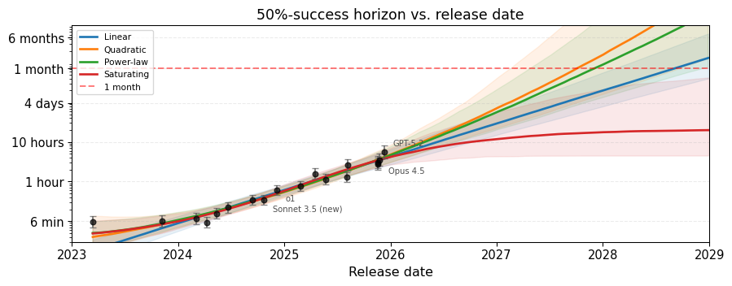
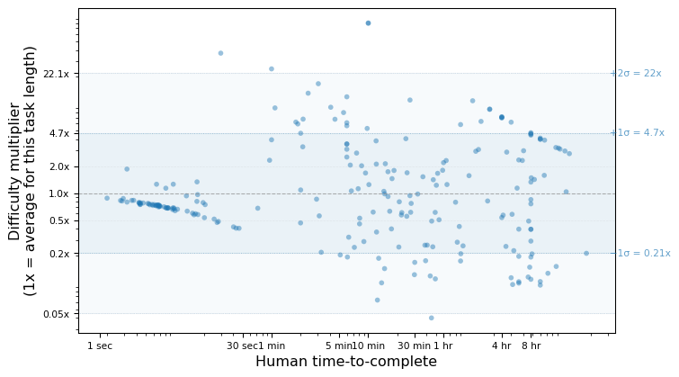
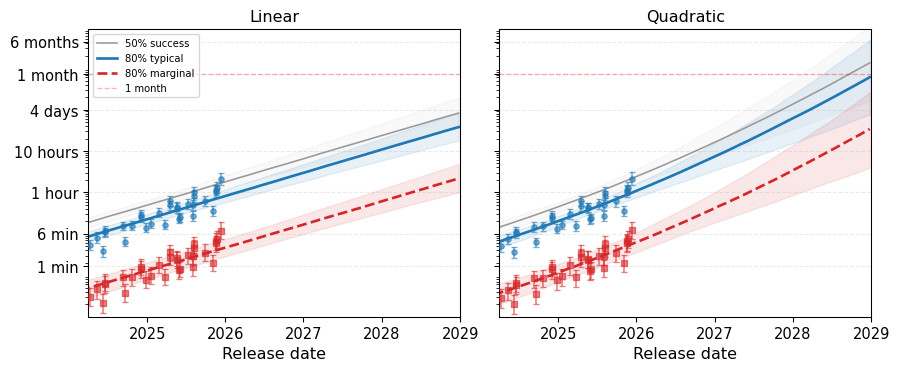

# Four models that fit the METR data equally well: A Bayesian analysis
Jonas Moss
2026-02-13

## TLDR

I reanalyzed the METR task data using a Bayesian item response theory
model.

- **The METR data cannot distinguish exponential from superexponential
  growth.** Four trajectory shapes (linear, quadratic, power-law,
  saturating) fit the existing data equally well but diverge on
  forecasts. For instance, the 95% credible interval for the 125-year
  crossing is 2031-01 – 2033-10 for linear and 2028-02 – 2031-09 for
  quadratic.
- **METR’s headline horizon numbers overstate current capability by
  roughly an order of magnitude at 80% success.** METR doesn’t model
  variation in task difficulty, so their horizons reflect a task of
  typical difficulty for its length. But tasks of the same length vary a
  lot in how hard they are, and at 80% success the hard ones dominate.
  Curiously, this doesn’t affect timelines by a lot, as it’s just a
  level-shift.
- **We need data about the human times to quantify uncertainty.**
  Credible intervals throughout are too narrow because I treat human
  times as known rather than estimating them as latent variables. I’m
  doing this because I don’t have access to all the raw data, and it
  could be a big deal.
- Doubling time under the standard linear (exponential growth) model is
  ~4.1 months, which is similar to METR’s estimate (95% credible
  interval: 3.5–5.0, but see caveat above).

## METR data

Let’s start with a plot that shouldn’t be too surprising. Four
reasonable models fit the [METR
data](https://github.com/METR/eval-analysis-public/tree/main/reports/time-horizon-1-1/data/raw)
equally well. They agree about the past but disagree strongly about the
future.

Figure 1: 50%-success horizon vs. release date under four trajectory
models.

The model selection scores known as ELPD-LOO differ by at most ~7
points.[^1] Calibration is nearly identical, with Brier $\approx$ 0.066
across the board. Your prior matters a lot here and has clear-cut
consequences, as the models agree about the past but disagree strongly
about the future.

These curves are fitted using a Bayesian item response theory model
described below. Before describing it, let’s recall METR’s analysis of
the time horizon. They proceed in two stages:

1.  *Per-model logistic regression.* For each model $i$, fit
    $P(\text{success}) = \sigma(\beta_i(\log h_i - \log t_j))$ where
    $t_j$ is human time for task $j$. Here $h_i$ is the task duration
    where the curve crosses 50%. When $t_j = h_i$, we get
    $\sigma(0) = 0.5$, a $50\%$ horizon. This gives a “horizon score”
    $h_i$ per model.

2.  *An OLS trend.* Regress $\log h_i$ on release date. The slope gives
    a doubling time of ~4.1 months.

This is good modeling and gets the main story right, but there are some
non-standard choices. For instance, the slope $\beta_i$ is per-model
rather than per-task (which is unusual in item response theory) and Stage
1 uncertainty doesn’t propagate into Stage 2. It also treats every task
of the same length as equally difficult and only considers one trajectory
shape.

In this post I make a joint model, adjust some things to be more in line
with standard practice, and ask what happens when you try different
trajectory shapes. The post is somewhat technical, but not so god-awful
that Claude won’t be able to answer any question you have about the
methodology. Models are fitted with Stan, 4 chains $\times$ 1000
post-warmup draws, with code available
[here](https://github.com/JonasMoss/metr-stats). I intentionally won’t
go into details about technicalities, e.g. prior choices – the code
contains everything you’ll want to know and your favorite LLM will
figure it out for you. (All priors were chosen by Codex / Claude Code
and appear reasonable enough.)

## Psychometrics

The first stage of METR’s model is *almost* a 2-parameter logistic model
(2PL), the workhorse of educational testing since the 1960s.

So, what kind of problems was the 2PL model designed for? Say you give
200 students a math exam with 50 questions and record their answers as
correct / incorrect. You want to estimate the students’ math ability,
but raw percent correct scores aren’t necessarily very good, as they
depend on which questions (easy or hard? relative to which students?)
happened to be on the exam.

The 2PL model solves this by giving each student a single ability score
($\theta_i$) and each question two parameters: a *difficulty* ($b_j$,
how hard it is) and a *discrimination* ($a_j$, how cleanly it separates
strong from weak students). “What is 3×2?” has low discrimination as
everyone gets it right regardless of ability. A simple proof-writing
question has high discrimination as sufficiently strong students can
solve it, but weak students have no chance.

The model estimates all parameters simultaneously via a logistic
regression:

$$
P(\text{success} \mid \text{model } i, \text{task } j) = \text{logit}^{-1}\bigl(a_j (\theta_i - b_j)\bigr)
$$

The reason this matters here is that METR tasks are like exam questions
— they vary in both difficulty and how cleanly they separate strong from
weak models — and we want to put all the models on a common ability
scale.

## Modeling difficulty

Ability and difficulty parameters $\theta_i, b_j$ in the 2PL are hard to
interpret. The scale is arbitrary, and it’s not clear what, for
instance, a 0.1 increase in ability actually means. Or whether it would
be better to take a log-transform of the parameter, etc. A really cool /
tubular feature of the METR data is that each task comes with a human
time, which gives us a natural, interpretable scale for difficulty. So
let’s connect human time to difficulty first.

$$
b_j \sim \mathcal{N}(\alpha + \kappa \cdot \log t_j, \;\sigma_b)
$$

Each task’s difficulty has a mean that depends on log human time, plus a
random component to account for the fact that same-length tasks are not
born equal. METR treats all tasks of identical length as equally hard.

Since difficulty increases with log human time at rate $\kappa$, we can
convert any difficulty value back into a time. Call it the *equivalent
difficulty time*. If a task takes humans 10 minutes but is unusually
hard for AI, its equivalent difficulty time might be 50 minutes, meaning
it’s as hard as a typical 50-minute task. Formally, a task with human
time $t$ and difficulty residual $u$ has equivalent difficulty time
$t \cdot \exp(u / \kappa)$.

I estimate $\sigma_b \approx 1.44$, which is large. One standard
deviation of unexplained difficulty corresponds to a ~4.7x multiplier in
equivalent difficulty time.[^2] A task that’s 1σ harder than average for
its length is as hard as a typical task 4.7x longer. At $\pm 2\sigma$
the range is roughly 22x, so tasks of identical human time can span a
huge range in actual difficulty for AI. Compared to the simpler
$b_j = \alpha + \kappa \cdot \log t_j$, the random effects widen the
credible intervals, so this modeling choice matters for honest
uncertainty.

Of course, this is a modeling choice that can be wrong. There’s no
guarantee that difficulty is linear in $\log t_j$, so we need
diagnostics to check. The plot below does double duty as model
diagnostic and explanation of what the random effect means in practice.

Figure 2: Each dot is a task. The y-axis shows how much harder or easier
the task is than a typical task of the same human time, expressed as a
multiplier in equivalent task time. Shaded bands show ±1σ and ±2σ.

The y-axis is the difficulty multiplier from above. A dot at 5x means
the task’s equivalent difficulty time is 5x its actual human time. Even
within the ±1σ band, tasks of identical human time can differ by a
factor of 22x in equivalent difficulty, so the practical spread is
enormous.

There’s not too much curvature in the relationship between log human
time and difficulty, so I think the log-linear form is decent, but it’s
much more spread out than we’d like. There is a cluster of easy outliers
on the far left, which I think can be explained by very short tasks
containing virtually no information about difficulty. Overall this looks
reasonable for modeling purposes.

## Modeling ability over time

By directly modeling ability over time, we can try out shapes like
exponential, subexponential, superexponential, saturating, and
singularity. Forecasts depend a lot on which shape you pick, and the
data doesn’t really tell you much, so it’s not easy to choose between
them. Your priors rule here.

The abilities are modeled as $$
\theta_i \sim \mathcal{N}\bigl(f(x_i;\, \gamma),\; \sigma_\theta\bigr)
$$

where $x_i$ is the model release date in years, centered at the mean
(September 2024). I’m still using a random effect for model ability
here, since nobody seriously thinks every model released on the same
date must be equally capable. I’m looking at four shapes for $f$:[^3]

| Model | $f(x)$ | Params | Intuition |
|:---|:---|:--:|:---|
| Linear | $\gamma_0 + \gamma_1 x$ | 2 | Linear $\theta$ = exponential horizon growth (constant doubling time) |
| Quadratic | $\gamma_0 + \gamma_1 x + \gamma_2 x^2$, $\gamma_2 \geq 0$ | 3 | Superexponential, accelerating growth |
| Power-law | $\gamma_0 + \gamma_1 \tilde{x}^{\alpha}$, $\alpha \in [0.1, 2]$ | 3 | Flexible: sub- or super-exponential. $\tilde{x}$ is a shifted/scaled version of $x$. |
| Saturating | $\theta_{\min} + \Delta\theta \cdot \text{logit}^{-1}(a + bx)$ | 4 | S-curve ceiling on ability. |

If METR’s GitHub repo contained all the historical data, I would also
have tried a piecewise linear with a breakpoint around the time of o1,
which visually fits the original METR graphs better than a plain linear
fit. But since the available data doesn’t go that far back, I don’t need
to, and the value of including those early points in a forecasting
exercise is questionable anyway. Getting hold of the latest data points
is more important.

All models share the same 2PL likelihood and task parameters ($b_j$,
$a_j$, $\alpha$, $\kappa$, $\sigma_b$). Only the model for $\theta$
changes.

### Crossing thresholds

Each model except the saturating model will cross any threshold given
enough time. Here are posteriors for the 50% crossing across our models.
The saturating model almost never crosses the 1-month and 125-year
thresholds since it saturates too fast.

Table 1: Predicted crossing dates for two horizon thresholds (1 month
and 125 years), by trajectory model.

<table style="width:100%">

<thead>

<tr>

<th rowspan="2">

Trend
</th>

<th colspan="2" style="text-align:center;border-bottom:none">

1 month
</th>

<th colspan="2" style="text-align:center;border-bottom:none">

125 years
</th>

</tr>

<tr>

<th>

Mean
</th>

<th>

95% CrI
</th>

<th>

Mean
</th>

<th>

95% CrI
</th>

</tr>

</thead>

<tbody>

<tr>

<td>

Linear
</td>

<td>

2028-07
</td>

<td>

2027-12 – 2029-05
</td>

<td>

2032-03
</td>

<td>

2031-01 – 2033-10
</td>

</tr>

<tr>

<td>

Quadratic
</td>

<td>

2027-08
</td>

<td>

2026-12 – 2028-07
</td>

<td>

2029-07
</td>

<td>

2028-02 – 2031-09
</td>

</tr>

<tr>

<td>

Power-law
</td>

<td>

2027-10
</td>

<td>

2027-02 – 2028-11
</td>

<td>

2030-02
</td>

<td>

2028-08 – 2032-11
</td>

</tr>

</tbody>

</table>

## Problems with 80% success

Everything above uses 50% success, but METR also cares about 80% success
and fits a separate model for that. We don’t need to do that here since
the model estimation doesn’t really depend on success rates at all.
We’ll just calculate the 80%-success horizon using posterior draws
instead.

But there are actually two reasonable ways to define “80% success,” and
they give different answers.

1.  *Typical:* Pick a task of average difficulty for its length. Can the
    model solve it 80% of the time? This is roughly what METR computes.

2.  *Marginal:* Pick a random task of that length. What’s the expected
    success rate? Because some tasks are much harder than average, the
    hard ones drag down the average more than easy ones push it up.

At 50%, the two definitions agree exactly. But at 80%, the gap is
roughly an order of magnitude!

Figure 3: Horizon forecasts at 80% success probability. Left: linear
trajectory. Right: quadratic (constrained).

So, on the one hand, it’s the variance ($\sigma_b \approx 1.44$) alone
that causes these two plots to be necessary under our model. But on the
other hand, the difference is not really a consequence of modeling. Some
tasks of the same human time vary a lot in how hard they are for our
models, and a phenomenon like this would happen for *any* model that’s
actually honest about this.

The marginal horizon is the one that matters for practical purposes.
“Typical” is optimistic since it only considers tasks of average
difficulty for their length. The marginal accounts for the full spread
of tasks, so it’s what you actually care about when predicting success
on a random task of some length. That said, frontier performance of 5
minutes does sound sort of short to me. I’m used to LLMs roughly
one-shotting longer tasks than that, but it usually takes iteration.
Just getting the context and subtle intentions right on the first try is
hard, so I’m willing to believe this estimate is reasonable.

Anyway, the predicted crossing dates at 80% success are:

Table 2: Predicted date when the 80%-success horizon reaches 1 month.
The saturating model is omitted (almost never crosses).

<table style="width:100%">

<thead>

<tr>

<th rowspan="2">

Trend
</th>

<th colspan="2" style="text-align:center;border-bottom:none">

Typical
</th>

<th colspan="2" style="text-align:center;border-bottom:none">

Marginal
</th>

</tr>

<tr>

<th>

Mean
</th>

<th>

95% CrI
</th>

<th>

Mean
</th>

<th>

95% CrI
</th>

</tr>

</thead>

<tbody>

<tr>

<td>

Linear
</td>

<td>

2028-12
</td>

<td>

2028-04 – 2029-10
</td>

<td>

2030-07
</td>

<td>

2029-08 – 2031-09
</td>

</tr>

<tr>

<td>

Quadratic
</td>

<td>

2027-10
</td>

<td>

2027-02 – 2028-11
</td>

<td>

2028-09
</td>

<td>

2027-08 – 2030-04
</td>

</tr>

<tr>

<td>

Power-law
</td>

<td>

2028-02
</td>

<td>

2027-05 – 2029-04
</td>

<td>

2029-02
</td>

<td>

2028-01 – 2031-01
</td>

</tr>

</tbody>

</table>

Table 3: Predicted date when the 80%-success horizon reaches 125 years.
The saturating model is omitted (never crosses).

<table style="width:100%">

<thead>

<tr>

<th rowspan="2">

Trend
</th>

<th colspan="2" style="text-align:center;border-bottom:none">

Typical
</th>

<th colspan="2" style="text-align:center;border-bottom:none">

Marginal
</th>

</tr>

<tr>

<th>

Mean
</th>

<th>

95% CrI
</th>

<th>

Mean
</th>

<th>

95% CrI
</th>

</tr>

</thead>

<tbody>

<tr>

<td>

Linear
</td>

<td>

2032-08
</td>

<td>

2031-05 – 2034-03
</td>

<td>

2034-02
</td>

<td>

2032-09 – 2036-03
</td>

</tr>

<tr>

<td>

Quadratic
</td>

<td>

2029-09
</td>

<td>

2028-03 – 2032-01
</td>

<td>

2030-05
</td>

<td>

2028-09 – 2033-05
</td>

</tr>

<tr>

<td>

Power-law
</td>

<td>

2030-05
</td>

<td>

2028-09 – 2033-05
</td>

<td>

2031-04
</td>

<td>

2029-04 – 2035-02
</td>

</tr>

</tbody>

</table>

Make of this what you will, but let’s go through one scenario. Let’s say
I’m a believer in superexponential models with no preference between
quadratic and power-law, so I have 50-50 weighting on those. Suppose
also I believe that 125 years is the magic number for the auto-coder of
[AI Futures](https://www.aifuturesmodel.com/), but I prefer $80\%$ to
$50\%$ as the latter is too brittle. Then, using the arguably correct
marginal formulation, my timeline has mean roughly November 2030, but
the typical framework yields roughly January 2030 instead. And this
isn’t too bad, just a difference of ~0.8 years! The linear model is
similar, with timelines pushed out roughly 1.6 years. So, the wide
marginal-typical gap doesn’t translate into big timeline gaps, as both
trajectories have the same slope, just at a different level.

Let’s also have a look at METR’s actual numbers. They report an 80%
horizon of around 15 minutes for Claude 3.7 Sonnet. Our typical 80%
horizon for that model under the linear trend is 22 minutes, and the
marginal is 1 minute—about 16x shorter than METR’s. Recall that METR’s
methodology doesn’t model task-level difficulty variation at all, so
their 80% horizon effectively reflects the typical tasks at each length
rather than a random draw.

## Implied doubling time

I get 4.1 months (95% credible interval: 3.5–5.0), which is close to
METR’s v1.1 estimate. Of course, doubling time only makes sense for the
linear model above, as the doubling time of the other models varies with
time.

Figure 4: Posterior distribution of the horizon doubling time under the
linear model.

## Modeling $t_j$

The available METR data contains the geometric mean of (usually 2-3)
successful human baselines per task, but not the individual times. Both
METR’s analysis and mine treat this reported mean as a known quantity,
discarding uncertainty. But we can model $t_j$ as a latent variable
informed by the reported baselines. This is easy enough to do in Stan,
and would give a more honest picture of what the data actually supports,
as all credible intervals will be widened.

I’d expect smaller differences between the typical and marginal plots at
$80\%$ horizon if the $t_j$ values were modeled properly, as more of the
variance in the random effect would be absorbed by the uncertainty in
$t_j$. I’m not sure how big the effect would be, but getting hold of the
data or doing a short simulation would help.

A technical point: When modeling $t_j$, I would also try a Weibull
distribution instead of log-normal, since the log-normal is typically
heavier-tailed and the Weibull is easier to justify on theoretical
grounds using its failure-rate interpretation.

## Notes and remarks

- I also tried a finite-time singularity model of the form
  $\theta \sim \gamma_0 + \gamma_1 x + c / (t^* - x)^\alpha$. The
  posterior on the singularity date $t^*$ didn’t really move from the
  prior at all. This is no surprise. It just means the data is
  uninformative.
- There are loads of other knobs you could turn. Perhaps you could
  introduce a discrimination parameter that varies by model and task,
  together with a hierarchical prior. Perhaps you could make
  discrimination a function of time, etc. I doubt any of these would
  change the picture much, if at all. The model fit is good enough as it
  is, even if the uncertainty is likely too small. That said, I don’t
  want to dissuade anyone from trying!
- The power-law model does in principle support both sub- and
  superexponential trajectories ($\alpha < 1$ and $\alpha > 1$,
  respectively, where $\alpha = 1$ is the linear model). The posterior
  puts $P(\alpha < 1) \approx 4\%$, so the data does not support
  subexponential growth. At least when using this model.
- There’s plenty of best-practice stuff I haven’t done, such as prior
  sensitivity analysis. (But we have a lot of data, and I wouldn’t
  expect it to matter too much.)

[^1]: The ELPD-LOO estimates are: linear $-2191.9$ (SE $70.1$),
    saturating $-2195.9$ (SE $70.2$), power-law $-2197.0$ (SE $70.1$),
    quadratic $-2198.7$ (SE $70.0$).

[^2]: The multiplier is $\exp(\sigma_b / \kappa)$ where
    $\kappa \approx 0.93$.

[^3]: Quadratic is the simplest choice of superexponential function. You
    could spin a story in its favor, but using it is somewhat arbitrary.
    The power-law is the simplest function that can be both super- and
    subexponential (in practice turns out to be superexponential here
    though), and I included the saturating model because, well, why not?
